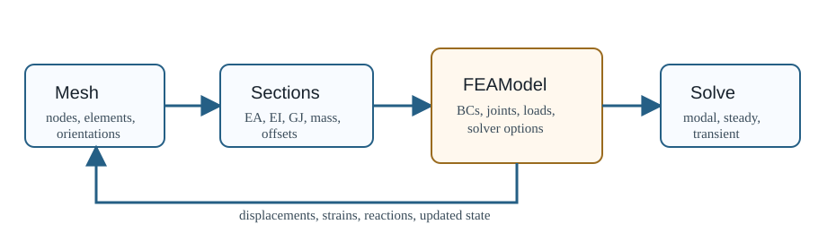

# OWENSFEA

OWENSFEA is the structural dynamics package in the OWENS toolkit. It provides
beam finite-element models used for turbine blades, struts, towers, and coupled
aeroelastic simulations. The code supports modal, nonlinear steady, transient,
and reduced-order structural workflows.

```@raw html
<p align="center">
    
</p>
```

The package is based on a Timoshenko beam formulation and the dynamic-system
work described in:

Owens, B. C., "Theoretical Developments and Practical Aspects of Dynamic Systems
in Wind Energy Applications," Ph.D. thesis, Texas A & M University, 2013.

## What This Package Owns

- structural mesh, element, section-property, and FEA model types;
- joint constraints, prescribed boundary conditions, and concentrated nodal
  terms;
- element stiffness, mass, damping, gravity, spin, and follower-load
  calculations;
- linear modal analysis, nonlinear steady solve, transient dynamics, and ROM
  utilities;
- structural reactions, strains, and post-solve helper maps used by OWENS.

## Where To Start

- Use the quickstart for a minimal model and test-backed workflow references.
- Use model assembly before changing meshes, joints, boundary conditions, or
  concentrated terms.
- Use the frames and units page before comparing against GXBeam, OpenFAST, or
  experimental data.
- Use the validation page before changing solver tolerances or reference data.
